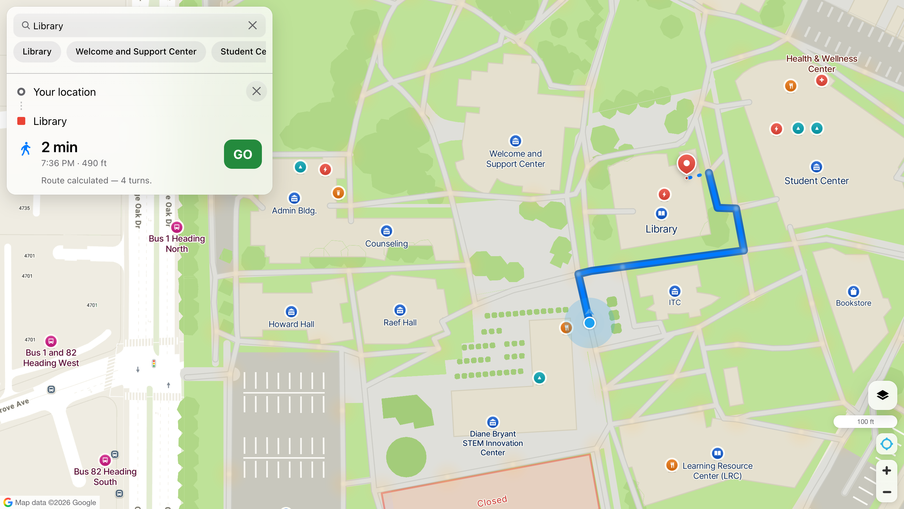
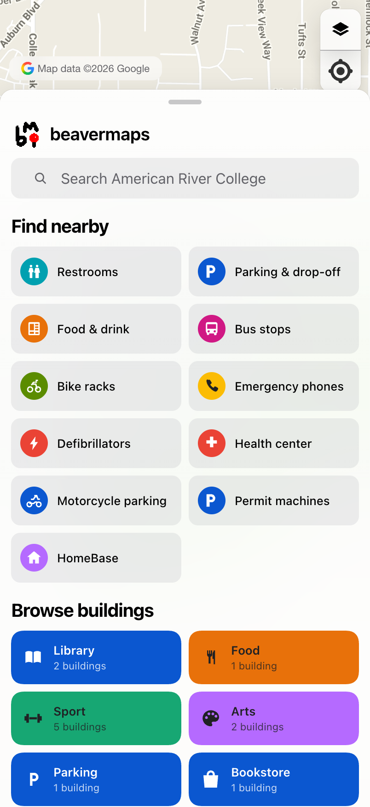

# beavermaps

A map of **my campus** — the college's own printed sheet,
rebuilt as the kind of map people already know how to use.

Search a building, a department or a room number. Browse what is on the campus by
what a building *is*, or find the nearest restroom, bus stop or defibrillator off
my campus's own printed key. Tap a building for what is inside it and an aerial view of
it. Then walk there, with turn-by-turn directions over the pavement my campus actually
drew rather than over the public roads around it.

It started as a click-two-points-and-route demo, which is where the routing
engine and the "what you see is not what you route on" idea come from. Almost
everything else is a campus map now.

## Demo



...and the front page of the sheet on a phone — my campus's printed legend on top, the
ten classes of building under it:



## What it does

**Find a place.** One field over three indexes: my campus's directory of 120 named
destinations, 33 buildings with what each one holds, and a room and course index
for the current term — 125 rooms and 557 course sections, so "ACCT 101" and
"Room 320" are lookups with a right answer rather than fuzzy name matches.

**Browse.** Two grids on the sheet's front page. *Find nearby* is the eleven rows
of my campus's printed legend — restrooms, parking, food, bus stops, bike racks,
emergency phones, defibrillators — which drops pins and outlines the ground that
holds them. *Browse buildings* is one coloured tile per class of building, for
the visitor who cannot search for a name they have never heard.

**Look at a building.** A card with what is inside it, its footprint, and — for
the ones that have something to fly around — a real aerial view, orbited.

**Walk there.** Turn-by-turn directions with a navigation banner, distance and
turn count, over my campus's own walkways. Start from your phone's GPS or from any
point on the map.

**Look right doing it.** Light, dark and follow-the-system, with the map's own
lighting following the actual sun overhead. Google or Mapbox drawing the
ground, switchable. An iOS-style bottom sheet with real detents on a phone, a
sidebar on a desktop. Installable to the home screen with its own icon.

## Under the hood

A quick-glance tour. See [`TECHNICAL_DOCS.md`](TECHNICAL_DOCS.md) for the deeper
writeup.

### The stack

- [Mapbox GL JS](https://docs.mapbox.com/mapbox-gl-js/) renders the map and every
  layer on it — my campus's traced basemap, the labels, the pins, the route.
- [Google Map Tiles API](https://developers.google.com/maps/documentation/tile)
  draws the ground by default; Mapbox Standard is the other half of a switch.
- [Turf.js](https://turfjs.org/) handles the geospatial snapping.
- [geojson-path-finder](https://github.com/perliedman/geojson-path-finder) does
  the graph routing, server-side, over a graph built once at boot.
- [Express](https://expressjs.com/) serves the routing API and the overlays,
  pre-compressed and ETagged.
- [Vite](https://vitejs.dev/) bundles it; [Tailwind CSS](https://tailwindcss.com/)
  is the stylesheet's entry point.

No icon package, no charting library, no UI framework. The three icon sets, the
map pins, the app icon and the favicon are all drawn in this repo — see
`src/map-images.js`, `src/g-icons.js`, `src/nav-icons.js` and
`scripts/build-icons.mjs`.

### What you see is not what you route on

The original idea, and still the load-bearing one: Mapbox renders a normal
basemap, and the pathfinding runs over a private network in `src/paths.json`.
The same arrangement works for trails, indoor paths, or a video-game grid.

### The network (`src/paths.json`)

A GeoJSON `FeatureCollection` of **803 `LineString` segments over 725 nodes**,
13.6 km in total. It **is** the light-grey paths my campus's printed map draws —
`scripts/build-walk-network.mjs` takes those polylines verbatim and makes the
smallest set of edits that turn a drawing into a graph.

That is the whole idea. Walkways on the sheet are stroked paths carrying a real
ground width — 105 of them, 10.5 km, 3.3 to 13.2 m wide — and the driveways and
crossings are drawn the same way, so those strokes *are* centrelines. Tracing
them gives a network that lies on the drawn pavement by construction:

| where a segment sits | my campus's own graph | traced from the sheet |
|---|---|---|
| drawn walkway | 411 (59%) | **623 (78%)** |
| driveway | 88 (13%) | **161 (20%)** |
| crossing | — | 6 (1%) |
| through a building | 83 | **0** |
| over lawn | 85 | **12 (1%)** |
| over parking bays | 27 | **0** |

#### Why not my campus's own routing graph

Their wayfinding app ships one in `Batch.json` — 696 edges over 580 nodes — and
this project used it for a while. It is real, it is theirs, and it is not the
same thing as the map. It draws a path along *both* sides of the Hutchison Loop
parking aisle, the northern one straight through the parking bays, and 83 of
its edges cut through building interiors. On screen that reads as nonsense,
because the pavement it describes is not the pavement the sheet shows. Their
own app never draws it — it only ever draws the computed route, so none of this
is visible to their users.

`Batch.json` is still the source for `places.json` and its `nodeIds`; only the
routing network stopped coming from it.

#### The seven stages, and why each exists

1. **Node.** Illustration linework crosses rather than joins — intersections
   happen mid-segment with no shared vertex. Every crossing is cut into both
   lines, or a junction on screen is not a junction in the graph.
2. **Weld.** Vertices within 2 m become one node; a draughtsman's "touching"
   endpoints sit a metre or two apart.
3. **Collapse.** *This is the one that matters.* The sheet draws corridor twice
   all over — a footway shadowing a driveway, a walkway drawn over itself, and
   every bar of a zebra crossing as its own stroke, so one crossing becomes five
   parallel routes. On paper the duplicates render as a single grey band and
   nobody can tell; ride a centreline down each and you get two and three lines
   threading one path.

   **The tolerance is the drawn width, not a constant.** Two centrelines are one
   corridor when the strokes painted on them overlap — half the sum of their two
   widths, floored at 3 m. A flat 3 m was the old rule, justified by paths being
   3.3 m wide: true of a walkway, wrong for a 6.6 m driveway, whose own edge is
   3.3 m from its centre. The footway beside the Portable Village runs **3.23 m**
   from that driveway's centreline — inside the carriageway it is drawn beside,
   dead parallel for 60 m — and missed the old cutoff by **23 cm**. It shipped as
   two separate ways, so an 11 m walk routed 404 ft up one and back down the
   other. The sheet has carried a per-stroke `width` all along; the script read
   it and threw it away. Using it takes 288 merges to **498**.

   Where the survivor lands follows the same logic: equal widths keep the
   **midpoint**, because a walkway drawn over itself really does have its
   centreline between the two strokes — but unequal widths keep the **narrower**
   one, because the pedestrian line beside a carriageway is the footway, not the
   average of footway and road. That is the preference *Dedupe* already applies
   by kind. Nodes are merged, never deleted, so no connection the drawing makes
   is lost.
4. **Tee.** The gap the first three leave. *Node* cuts where two segments
   **cross**, so a stroke that *ends* on another never produces a cut — it does
   not cross it. *Weld* joins vertex to vertex, and there is no vertex halfway
   along a line. *Collapse* does project a node onto a segment, but only one
   running the same way, because it exists to merge duplicate corridors — which
   excludes the perpendicular T-junction exactly. So a footway drawn up to a
   walkway and stopping half a metre short was a junction on paper and nothing
   at all in the graph, and the map showed paths ending mid-car-park with a
   round cap. 32 dead ends are teed onto the stroke they stop short of, at a
   3 m one-path-width tolerance.
5. **Junction.** Two lines that pass within a few metres and never join. It is a
   junction on paper and nothing at all in the graph, and none of the four
   stages above can see it: it is not a crossing, so *Node* cuts nothing; it
   shares no vertex, so *Weld* has nothing to join; neither end is loose, so
   *Tee* skips it; it is not parallel, so *Collapse* excludes it. That shape
   turned an 11 m walk into 140 ft.

   The guard is what makes this safe: a junction is welded only where the graph
   **already makes you walk six times further around** than the ground distance.
   Paths that legitimately pass close without meeting — a ramp beside its stair,
   a way over a culvert — are left alone, because for them the walk-around is
   already short. 12 are welded. It adds a node; it never adds a metre.
6. **Link.** The one stage that is *not* the drawing. `src/path-links.json`
   holds connectors added by hand where the sheet omits something plainly
   visible on the ground, each with a `why` naming what is there and what the
   sheet drew instead. It is a separate file, applied as its own stage, and its
   count and metres print on every build — currently **11 links, 191 m out of
   13.6 km (1.4%)**, so the invented share is never in doubt.

   Three of the eleven are **rescues**: connectors that bring a whole stranded
   fragment into the largest component. They carry **571 m, 409 m and 120 m** of
   my campus's own drawn linework — 1,100 m returned to the routable network for 46 m
   of connector. The largest is the entire perimeter footway around the south car
   park, which was stranded because the sheet never joins it to campus; it comes
   within **9.7 m** of the network at the head of the accessible bays, across
   hatched crossing markings and unbroken tarmac.

   Every link is load-bearing, and the two kinds are tested differently. Local
   links are ablated on the walk between their own endpoints. That test is
   meaningless for a rescue — pull one and its fragment is pruned, so an endpoint
   stops existing and the measurement compares two snaps onto the same surviving
   node — so rescues are ablated on **shipped metres** instead.

   **It is a last resort, and the first attempt got this wrong.** That pass wrote
   15 links; checked afterwards, **eleven of them ran parallel to a path my campus
   already draws**. The gap was never a missing path — it was a drawn path
   failing to join the graph — so a straight connector alongside it fixed the
   number and left two splintered lines down one corridor on screen. *Junction*
   repairs the cause instead, and six of the fifteen were then shown redundant by
   ablation: removed one at a time, rebuilt, and the detour did not come back.

   These came out of a sweep, not a hunch. All-pairs shortest path over the whole
   graph, flagging every pair of nodes within 30 m of each other that is four
   times further apart *through the network*: 31 distinct gaps, the worst of them
   23 m on foot and **592 m** to walk. Each was then checked three ways — against
   my campus's ground polygons in painter's order, against an excess-green measurement
   of the satellite imagery, and by eye at z21.

   **Fourteen were accepted and seventeen refused**, and the refusals are
   recorded in the file next to the links. Nine cross building footprints, four
   cross lawn or a grassed swale, two end on a roof, one ends in a planted bed
   and one crosses a kerb with no dropped ramp. They will keep showing up as
   large detours in any future audit, and they should: being near is not the same
   as being connected. A second pass over the rebuilt graph surfaced five more
   candidates and refused all five.

   The clearest accepted case is the Hutchison Loop bus stop: the sheet draws the
   zebra crossing over the road and stops at the kerb, but the crossing lands on
   a concrete pad that ramps down to the south footway. Without it, an 11 m walk
   across the road routed 804 ft round three sides of a rectangle.
7. **Splice.** The router only accepts vertices, so every positioned
   destination gets a node at its closest point on the network — otherwise a
   path can run right past a building while its nearest *vertex* is fifty
   metres away, and the destination quietly resolves somewhere else.

There is still deliberately **no automatic bridging step**. An earlier version
closed gaps between fragments with 42 *generated* connectors — a guess made 42
times unsupervised. *Link* is the opposite of that: each entry is written down by
hand with a reason and counted in the log. And teeing is neither: it splits an
edge that already exists at a point a dead end is already touching, and it adds
no length of its own. Turning it off drops the shipped network from 12,255 m
over 16 fragments to **11,603 m over 29** — 652 m of already-drawn path that
would otherwise be thrown away for want of a junction. 3 m is where that trade
turns, too: measured at 5 and 8 m the largest component starts *losing* nodes,
and by 8 m total drawn length falls, because dead ends begin merging onto paths
they merely pass near.

#### The biggest thing still wrong

**479 m of drawn path still never reaches the routable graph** — 26 strokes,
measured by sampling each drawn walkway, driveway and crossing and asking
whether anything in `paths.json` runs within 3 m of it. It was **1,694 m over 34
strokes**, including a 357 m driveway, a 204 m driveway and a 150 m walkway, all
100% absent.

The cause was not what it looked like. *Dedupe* was the obvious suspect and is
almost innocent: it drops 151 m in total, of which only **6 m** is genuinely
uncovered by the surviving stroke — every real duplicate on this sheet is
shadowed at 75–100%. It is now hardened anyway, because nothing was stopping
that 6 m from becoming 600 m on a data change: a stroke with an uncovered tail
over 4 m is kept rather than dropped whole, and the count prints.

The actual loss was **stranded fragments** — 1,324 m in 14 pieces that never
join the largest component. Three of them account for 1,055 m and sit 9.7 m,
15.7 m and 20.6 m from the network; those are now rescued through
`path-links.json`. The seven that remain need **75 to 117 m** of invented path to
reach, which is the automatic bridging step this pipeline refuses to have. The
largest stroke still missing is 72 m.

The cost is still paid honestly: whatever the drawing leaves genuinely
disconnected stays disconnected — 16 fragments over 86 nodes, down from 31 over
143 — and only the largest component ships.

#### One projection, applied to everything

Everything — network, artwork, buildings, labels — comes out of one SVG
coordinate space through `scripts/projection.mjs`, and nothing is nudged
afterwards. Residual error is therefore shared: it moves the whole map as a
body and never shows.

An earlier pass fitted per-node corrections onto OSM linework. It is deleted
and should not come back. Because the corrections were keyed by my campus node ID
they could never be applied to artwork that has no node IDs, so they moved the
grid and left the drawing behind — and they pushed **15 of my campus's own
destinations out of their own buildings** (75 of 145 places landed inside a
footprint, against 90 after removal). Improving one layer's agreement with an
outside reference makes the map disagree with itself. Fix the transform or
retrace the source; never nudge a single layer.

### Off campus (`src/approach-paths.json`)

my campus's sheet stops at the fence and so did the router: click a start point on the
pavement outside and the nearest graph vertex was somewhere inside the campus,
so the walk began in the wrong place. `scripts/build-approach-network.mjs` adds
the streets you arrive by — **6,342 segments, 125 km** in an 800 m apron.

**It is not Google's paths, and it cannot be.** The Map Tiles API serves
*pictures* of roads; there is no graph in a raster tile and nothing in the
response says where a footway goes. Their Routes API does know, but it is a
per-request billed server call answering in its own geometry — a second network
to stitch to ours at every entrance, with its own snapping and its own idea of
where the kerb is. That seam is the thing this file exists to remove. So the
off-campus network comes from OpenStreetMap, which is where the campus boundary
already comes from and what Mapbox draws from anyway. One graph, one router, one
route line, turn-by-turn that works across the fence, no per-request cost.

**Nothing from this file is ever drawn.** Whichever provider is painting the
ground is already drawing these streets, and putting ours on top of theirs is
exactly the doubled linework the campus edge used to show. The only thing you
see from it is the route ribbon lying along it.

Five stages, each printed on every build:

1. **Fetch** every OSM way in the apron a person on foot may legally use —
   selected by exclusion, because listing what to *keep* silently drops a footway
   with an unexpected tag, and around a campus those are the paths people take.
2. **Clip** to the apron *and* to the campus. Both are load-bearing. Overpass's
   bounding box selects **ways**, and `out geom` returns each match whole — Auburn
   Blvd came back running two kilometres past the box. And inside the fence my campus's
   drawing is the better data: OSM has a dozen generalised paths where the sheet
   has 141 walkways.
3. **Weld** coincident vertices at 0.5 m. Connected OSM ways share a node
   exactly, so this guards rounding rather than inventing junctions — and ways
   that merely *cross* are left crossing, because in OSM that means a bridge.
4. **Gate** — join the two networks where my campus's linework already reaches the
   street. **15 connectors, 38 m in total.** Ten of them are under 2 m and are
   the same ground drawn twice; the other five are listed individually with their
   length, and each is the only way in within 250 m.
5. **Prune** to the component the campus is in, seeded from the campus rather
   than from the largest piece — what has to ship is what a walker standing on
   my campus can actually reach.

The gate guard is the part worth stating. my campus draws its own perimeter driveways
and OSM draws the same streets about three metres away, so for hundreds of
metres the two run side by side and every campus vertex along them looks like a
door. The first version used `build-walk-network.mjs`'s local test — "already
joined within six times the gap" — and accepted **80** connectors: the second one
twenty metres along the same kerb sees a 43 m walk round through the first, which
is outside a 19 m cap, so it is admitted, and so is the next. That is sewing a
seam, not finding a door. The question is absolute, so the threshold is: a
connector over 2 m is only taken where the merged graph does not already put its
two ends within 250 m of each other on foot.

The server unions the two collections into one `PathFinder` —
`geojson-path-finder` builds topology from coordinates, so concatenation *is* the
merge, and the gate connectors end on my campus's vertices at exactly the seven
decimals those vertices are written at. `/api/network` still serves my campus's paths
alone, for drawing; `/api/vertices` serves every vertex in the merged graph, for
snapping.

### The routing flow (`src/main.js`)

- **On load** it asks the server for two different things, because what gets
  drawn and what gets routed on are no longer the same set. `/api/network` is
  my campus's own paths, drawn the way Google Maps draws a road — two line layers over
  one source, a white core inside a wider grey casing — so the routing grid and
  the pavement my campus drew underneath it read as one thing rather than an overlay,
  and clipped at the boundary so it never lands on a road the basemap is already
  drawing. `/api/vertices` is every vertex in the *merged* graph, campus and
  approach streets alike, as bare coordinate pairs; that is what clicks snap to.
- **On click**, `turf.nearestPoint` snaps the click to the closest vertex — which
  is why a start point on the pavement outside now stays outside instead of
  being dragged onto the campus. The first click becomes the start marker, the
  second the end marker — both drawn as Google's pin (`googlePin` in
  `src/map-images.js`), green for the origin and red for the destination,
  anchored at the tip rather than the centre.
- **Routing** posts both ends to `/api/route`, where one `PathFinder` over the
  merged graph answers with the path, the distance and the turn-by-turn. The
  geometry feeds a `calculated-route` source (Google's navigation blue,
  `#4285f4`, over a darker blue casing). A missing path clears the end marker
  and shows an error.
- **Framing.** A finished route is brought into view unless it is already there
  — the same rule the category chips use, and for the same reason: a gratuitous
  `flyTo` throws away wherever the user had panned to. This is also why picking a
  destination no longer flies to it when a start point already exists; doing both
  landed on the destination and then judged the route against the view it had
  before the flight, leaving half the walk off the top of the screen.
- **Clear** (button, or a third click) removes the markers and empties the route
  source.

## The interface

The chrome is modelled on Google Maps, because that is the interface everyone
arriving at this app has already learned. The map is the page and everything
else floats over it — a full-bleed canvas, a pill search field, the layers
switcher in the bottom-left corner and the map controls in the bottom-right. The
previous layout put a 600 px map inside a padded card under a page heading,
which spent the top third of a phone screen on furniture.

Above the phone breakpoint that floating column is a sidebar; below it, it is a
bottom sheet with three detents and a grabber you can drag (`src/sheet.js`), and
one panel at a time inside it (`src/sheet-stack.js`). my campus's printed key had a
chip strip across the top for a while and it is the legend panel now — twelve
categories in a slot four wide is a control you have to scroll to read.

### Who draws the ground (`src/provider.js`)

Mapbox or Google, and it is a **third axis** rather than a third value on the
basemap toggle, because it is genuinely independent of the other two: both
providers offer a road map and imagery, both are readable in either theme, and
every combination of provider × basemap × theme means something. Everything
drawn *on* the ground — the network, my campus's sheet, the labels, the route, the
pins — is ours either way and does not change.

Like the appearance control, it appears **twice and holds no state in either
place**: a button on the rail beside the theme, and a row in the layers menu.
`surfaces` is a list, every one of them redrawn from a single `provider` on
every change, so neither can drift — neither holds anything. The rail is hidden
below 640 px, which is why the menu keeps its row rather than handing the
control over.

Google is the default and Mapbox is the fallback, and it has to be that way
round: Google's half can fail where Mapbox's cannot — a missing key, a disabled
Map Tiles API, a referrer the key does not allow — and none of those can be
detected until a session is actually requested. `revert()` puts every surface
back when one comes back refused, so no label is left claiming a basemap that is
not drawn.

Every one of these toggles advertises what pressing it will **do**, not what is
on screen — "Satellite" when you are on the road map, "Google" when Mapbox is
drawing. The appearance button is the exception, and has to be: it cycles three
ways, so it names where you are and puts where you are going in its label.

#### Nobody else's business

Google's roadmap labels every organisation it knows about, and around my campus that
is a mortgage broker, an HVAC firm, a dog trainer, an adult school and the SALAM
Islamic Center. On a map that is otherwise entirely my campus's they read as though
they were part of it, and a wayfinder for one campus should not be quietly
advertising its neighbours. Both grounds now drop them.

It has to be done **in the session request**, not by clipping. Everywhere else
this app removes the basemap's own data with a `clip` layer over the campus
polygon — but that only works on vector features. Google's are painted into the
raster before it arrives, and a tile is a picture. `createSession` takes the same
style array the Maps JS API uses, and that is the only place a label can still be
talked out of existing:

```js
{ featureType: 'poi', elementType: 'labels', stylers: [{ visibility: 'off' }] }
```

`labels`, not the whole feature, so parkland keeps its green — the fill is
geography and only the name is an establishment. Rendering both variants
side by side, that is the entire difference: identical green shapes, no words on
top of them.

Park names were an exception for one draft, on the reasoning that a park is a
place rather than an organisation. Rendering it settled that too: what Google
prints over the green west of campus is *"Arcade Creek Recreation & Park
District"*, which is a public agency with a board and a budget. There is no line
to draw between the kinds of organisation, so none is drawn.

Mapbox needs no style array — Standard exposes it as a configuration property,
`showPointOfInterestLabels: false`. Verified the way the difference actually
matters: `queryRenderedFeatures` over its POI layers returns **0**.

Place names stay on both. A neighbourhood is context; an establishment is an
advertisement.

### Appearance: light, dark, auto

Three states, and the third one is why it is not a switch. **Auto is not a
colour** — it is the absence of a choice, the app deferring to
`prefers-color-scheme`. A two-way toggle can express dark and light but has
nowhere to put "go back to following the system", so the moment a visitor
touched it they were pinned to whatever they picked, permanently. Google uses
the same three under Settings → Appearance.

It appears twice and holds no state in either place: the **rail** carries a
one-glyph cycle, and the **layers menu** carries the explicit three under their
own heading — which is what a phone gets, since the rail is hidden below 640 px.
Both are redrawn from a single `mode` on every change, so neither can drift.
What is persisted is the *mode*, not the resolved theme; storing "dark" because
someone picked Auto on a dark machine would silently pin them the first time
they opened the app at night.

#### The night preset was eating the buildings

Starting a walk turned the campus into pitch-black blocks, and ending it left
them there. Two independent faults, both worth naming because both are the kind
that read as a styling choice:

- `campus-buildings` was the one layer in the file **missing
  `fill-extrusion-emissive-strength`**. Mapbox Standard lights extrusions through
  its own model, and under the night preset that drove an authored `#2f3336` to
  roughly `#0c0d0d`. Every other custom layer already carries this opt-out with a
  comment explaining it; the extrusion is the one that was missed. It is set to
  **0.75, not the flat 1** the others use — they are ground planes and want their
  colour rendered exactly as written, while this is the only genuinely
  three-dimensional thing on the map, and at 1 every face renders identically and
  a building reads as a sticker.
- Nothing ever took the layer down. Extrusion is navigation-only — every other
  reference to it in `main.js` is guarded by `navActive` — but `endNavigation`
  never removed it, so the blocks outlived the walk that put them there.

### Where our map stops (`src/campus-clip.js`)

The rule is "inside the boundary the map is ours and outside it is theirs", and
for a while only half of it was enforced. `addCampusMask` took the basemap's own
data *out* of the campus; nothing stopped parts of my campus's sheet being drawn
*outside* it, on a ground that was already drawing the same things. That was
what the seam at the campus edge was made of:

| drawn beyond the fence | what it landed on |
| --- | --- |
| 23 `offsite_road` elements | Auburn Blvd, Myrtle Ave and College Oak Dr, drawn a few metres off the provider's own |
| 2 `north_arrow` elements | a print convention with nothing to point at on a rotatable map, sitting in a residential street |
| 21 crossings, 59 tree canopies, 2 driveway stubs | the public verge |
| 17 segments of the white path ribbon | a public road the basemap was drawing underneath it |

`trimToCampus` handles both shapes. A **LineString is cut** at the boundary and
its inside parts kept — dropping it would be wrong, because a driveway that runs
out to the street has to stop at the gate, not vanish from the last junction
inside it. **Anything else is dropped only when it lies wholly outside**;
clipping a polygon to a fifty-vertex ring is a much larger problem, and what it
would buy is a metre of overhang on the elements that straddle the line. Wholly
rather than mostly for a second reason too: the crossings at my campus's entrances are
drawn straddling the boundary because that is where they are, and a majority test
eats the campus edge rather than tidying it.

Three amenities are a deliberate exception — the bus stops on the perimeter road
sit outside the ring, and Google draws a generic transit icon near each. They
stay, because my campus publishes them by route and direction ("Bus 1 Heading North")
and that is information the campus map exists to carry.

### Labels, at Google's sizes

my campus set its building names between 6.0 and 14.5 pt, and that ordering is real
information — Library is 13.1 pt against Oak Cafe's 6.6. Using those numbers *as
pixels* was the mistake: they were set for a sheet 34 inches wide, and they gave
a 6.6–16 px spread against the 11–15 px Google sets its own labels in. On the
Google ground ours were visibly the smaller map's type on the bigger map's
ground.

Two changes, both measured off the raster rather than taken from a spec. The
print range is **remapped onto Google's band** (their road labels are 11–12 px,
an ordinary POI 12, a prominent one 14–15) and the ordering survives the remap.
And the zoom ramp is **flattened from 1.1×–1.9× to 0.86×–1.1×**: a Google label
is very nearly the same size at z15 as at z19, because their type is chrome for
reading the map rather than something drawn on the ground. Ours grew with the
campus, so the two agreed at exactly one zoom level and diverged either side.

Bigger type is wider type, and width is what the collision solver charges for,
so this was measured against the running map before and after: **27 of the 39
building names place at the default view, against 28 before.** One name, for
labels that stop announcing which half of the map you are reading.

### Pins that look like Apple's

Two states, both measured off a screen capture of Apple Maps rather than
described from memory. Their marker is not one shape at two sizes — selecting a
place changes **what it is**:

| | at rest | selected |
|---|---|---|
| shape | a flat **circle** | a teardrop that rises off the ground |
| sits | **on** the place | above it, leaving a **dot** behind on the spot |
| ring | 0.117 of the width | 0.070 of the width |
| fill | flat category colour | a vertical gradient, +18% top, −12% bottom |
| label | category hue, darkened | near-black |

The ratios come out of the capture divided through by its own scale: 30 px
across with a 3.5 px ring at rest; 79 px across with a ~5 px ring selected,
widest at y=455 with the tip at y=499, so the nub drops only **0.152 r** below
the head — against Google's 0.42, which is why theirs reads as a balloon on a
string and Apple's as a spike stuck to the bottom of a circle.

This replaced Google's balloon, which the map wore until the selection animation
was built and the marker it animated no longer matched the one the animation had
been measured from.

#### One hue per function

This map used to spend a single blue on **eight of the twelve** amenity kinds.
That was survivable while every marker carried its name in type beside it, and
stopped being survivable the moment those names came off: a car park showed four
telephones, two bike racks and two parking marks as eight identical blue dots.

The replacement set was **searched rather than chosen**. Pairwise CIE-Lab
distance across all ten hues has a minimum of **31.0** — which is what the
six-hue palette it replaces already scored (31.6, red against orange), so ten
hues cost nothing in separability while cutting the worst hue-sharing from eight
kinds to three.

Four are Google's own, sampled off their raster and not up for renegotiation:
`#ea4335` medical, `#0b57d0` transport and parking, `#e8710a` food, `#b56aff`
arts. The rest were searched for maximum separation against those:

| | | |
|---|---|---|
| `#fbbc04` | emergency telephones | Google's yellow, and the colour a call point is painted in the physical world |
| `#5b8c00` | bike racks | green is obvious for a bicycle, and Google's own `#188038` is **unavailable** — this map already spent its green on sport, and `#188038` sits dE **19.9** from it, close enough to read as the same marker. The olive is dE 42.1 away |
| `#00a0b0` | restrooms | |
| `#d01884` | bus stops and drop-off | one thing: transit |

Yellow brought a second problem with it. A white pictogram on `#fbbc04` is
**1.71:1** — at 16 px, a yellow disc with nothing legible in it. So the glyph
colour is a rule rather than a table: white, unless white would fall below
WCAG's 3:1 for a non-text graphic, in which case the map's own ink. Of the ten
hues exactly one fails, so every marker that was already fine keeps the white
glyph it had, and adding a hue later cannot quietly restyle them.

Both properties are asserted: no two hues closer than dE 28, and every glyph and
every label above 3:1 and 4.5:1 respectively, in both themes.

#### Eighty-four markers on one campus

Two rules thin the ambient layer, and between them the Parking Garage went from
seven markers under fourteen lines of type to one label and a few small discs.

**A name is printed only when it identifies.** Of 84 amenities, 80 carry a label
shared with at least one other — "Emergency telephone" fourteen times, "Bike
rack" fifteen. On the map those are not names, they are the icon's own meaning
set in type, and four of them landed on the Parking Garage at once. Four survive
and they are the four worth reading: the Health & Wellness Center, and the three
bus stops, whose labels carry the route and the direction rather than the word
"bus". The rest keep their label for the card to print on a tap. Nothing is lost;
it is moved to where there is room for it.

**A marker appears at the zoom it becomes useful.** The split is between things
you go *looking* for and things you notice once you are already somewhere:

| | | from |
|---|---|---|
| destinations | health centre, defibrillators, restrooms, bus stops, vending, drop-off | **z16** |
| infrastructure | 14 emergency phones, 15 bike racks, 10 permit machines, 8 parking badges, 6 motorcycle bays | **z18** |

31 markers where the whole campus fits, all 84 by the time you are looking at a
building or two. Nobody scans a campus for an emergency telephone; plenty of
people scan it for a restroom.

Nothing is hidden, only deferred. Every one of those kinds has a chip that draws
**all** of them at any zoom — the Emergency phones chip renders 14 of 14 at
z16.6 — and a legend row that outlines the buildings and car parks holding them.
The rank governs the ambient layer only: the one you did not ask for.

The thresholds are **integers**, and that is load-bearing rather than tidy: a
zoom expression inside a Mapbox `filter` is only re-evaluated at integer zoom
levels, so a 17.5 would behave as 17 or 18 and the table would be quietly lying
about where the line is.

#### The label moved with it, and that is the larger half

Google writes a POI's name **beside** its pin, vertically centred on the head.
Apple writes it **beneath**, centred, and tints it with the marker's own category
hue rather than the map's text colour — a #2fb342 park disc carries a #005100
name. That is the same hue at roughly a third of the lightness, and it is what
makes a field of markers scannable by colour before a single word has been read.

So every layer that draws one of these anchors `center` rather than `bottom`,
and every name that goes with one hangs under it in `pinInk` rather than beside
it in slate. Three consequences worth naming:

- The **em problem went away**. With the tip on the place, a label set beside the
  head needed a fixed ~12.5 px lift, and `text-offset` has no unit but ems —
  whatever size my campus happened to set that particular name at, so no one value was
  right for both the 11 px labels and the 16 px ones. Underneath, the offset only
  has to clear the disc's own lower half, and a bigger name genuinely *should*
  stand further off a bigger disc. The em is the unit this arrangement wants.
- **Amenity names appear from z17.** my campus's are generic — five "Emergency
  telephone"s can be on screen at once — so below that the disc's colour and
  glyph carry it alone, which is what they were drawn to do. Apple holds its own
  POI names back the same way.
- **The tint is dropped over imagery.** A photograph has no fixed ground value
  for a third-lightness hue to sit against, so satellite goes back to one
  high-contrast white. On the dark theme the tint inverts — lightened rather than
  darkened — because a dark green on near-black is a smudge, not a label.

#### The last few metres

A route runs between **graph vertices**, and neither end of a journey is one.
my campus binds its destinations to their own node ids, which sit a metre or two off
ours because this network is traced from the printed sheet rather than taken
from their graph; an amenity is wherever its pictogram is, which for half of
them is inside a building. So the blue line stopped short of the pin — measured,
10.9 m on a Library route — and read as a routing failure.

It is drawn now, as a row of dots in the route's own blue, in its own layer
rather than by extending the route geometry. That distinction is the honest one:
this is not path, it is the walk from the path to the door, and every mapping
app draws it differently for that reason. It also keeps the maneuver list and
the simulator working off the network geometry alone, which is the only thing
either of them can follow. Legs under 12 ft are left undrawn — below that it is
a nub, not a walk.

#### The route's two ends

They wear the same silhouette, in green and red, with a plain white hole where a
glyph would go. Not a shape invented for them: on Apple's map a dropped pin *is*
their selected marker with nothing categorical in the head, so `routePin` and
`liftedSvg` are one drawing with different contents. The capture shows no route,
so nothing here is guessed — it is the geometry already measured, reused.

Two consequences:

- The anchor is the **dot**, not the box's bottom edge. Half the dot hangs below
  the element, so a `bottom` anchor alone would sit the whole pin that half-dot
  high; `liftedOffset` pushes it back down. Measured in a running browser, the
  dot's centre lands on the marker's own translate to the pixel.
- They **drop in** on the same spring, 380 ms rather than the selection's 540 —
  this is a thing arriving, not a thing being picked up. The animation goes on
  an inner element for the same reason the selection's does: Mapbox owns the
  marker's own `transform` and rewrites it on every frame of every pan.

### Selecting a pin (`src/pin-select.js`)

Tapping a pin lifts it: the symbol comes out of its layer, an HTML marker takes
its place at exactly the size the symbol was being drawn at, and it **springs**
up to the selected size with its name underneath and a card above.

The motion is Apple Maps', measured rather than imitated. A 60 fps capture of
their macOS Maps selecting a park was taken apart frame by frame and the
marker's width read off each one:

```
ms      0   17   33   50   83  117  150  183  217  250  283  317  350  450
width  15   21   27   31   35   42   47   51   56   55   59   58   57   56
```

It grows, **overshoots by about 7%**, and settles back. That overshoot is the
whole character of the thing: the same move without it reads as a resize, and
with it reads as something being picked up.

#### Fitting it took two goes

A cubic-bezier interpolates between the size you start at and the size you end
at, so the overshoot you *see* is the curve's overshoot scaled by that gap — and
our gap is not Apple's. Their ambient icon is 27% of their selected one; ours is
37% of ours, because a 26-unit disc at the sizes this map draws it is
proportionally a bigger thing than their POI dot.

Fit the curve to their **normalised progress** and you reproduce their timing
exactly while the pin visibly bounces two thirds as far, which is the half of it
anyone actually watches. So the fit is against **apparent size** — width as a
fraction of the settled width — with the overshoot constrained to land where
theirs lands:

| | fit (SSE) | visible peak |
|---|---|---|
| `cubic-bezier(0.5, 1.525, 0.5, 1)` / 540 ms | **0.019** | **1.055×** at 308 ms |
| `cubic-bezier(0.4, 1.45, 0.85, 1)` / 460 ms — fits normalised progress | 0.037 | 1.042× at 329 ms |
| `cubic-bezier(0.34, 1.56, 0.64, 1)` — the stock spring | 0.174 | 1.062× at 263 ms |
| Apple, measured | — | 1.063× at 283 ms |

The first is what ships. Measured back out of a running browser off the computed
transform matrix, it peaks at **1.0549× at 317 ms** — the stock spring gets the
peak height about right by luck and fits the rest of the curve nine times worse,
arriving early and then hanging.

Going the other way is deliberately not the same curve reversed: nothing is
being picked up on the way out, so it is 190 ms with no bounce at all. A pin
that sprang on the way down would look dropped rather than put back.

#### How it is built

**An HTML marker, not a bigger symbol.** A symbol layer can only be resized by
pushing a new `icon-size` on every frame, which restyles the whole layer to move
one icon and rasterises a 2× image past its own resolution while it does it. As
an element it is an SVG the browser re-renders crisply at any scale and the
easing is one CSS property.

**Two things animate, not one**, and the reason is the shape change underneath.
The resting marker is a disc sitting *on* the place; the lifted one is a head
floating *above* it with a dot left behind on the spot. They do not agree about
where the head goes, so simply scaling one into the other pops it upward by
three quarters of its own width the instant it is tapped. So:

- `transform-origin` is the **anchor dot** — the one part of the drawing that
  claims a position never moves, at any scale, at any point in the animation.
- a `translateY` alongside the scale starts the head exactly where the disc was,
  on the place, and carries it up to where a lifted head belongs. Both sit in one
  transform, so one timing function drives them and the rise springs with the
  growth instead of racing it. Measured back: the dot's centre lands within a
  pixel of the coordinate, and the label sits 3 px under it.

Two more details are load-bearing:

- The scale goes on an **inner** element. Mapbox owns the marker's own
  `transform` and rewrites it on every frame of every pan.
- `generateId: true` on both pin sources. `amenities.json` carries no identifier
  — six features all say `defibrillator` — so without it there is no filter that
  can hide the one that was tapped and leave the other five standing. Miss this
  and the ambient pin sits inside its own enlarged self.

The starting size is not a guess either. Both layers interpolate `icon-size`
between two zooms, and those stops live in `pin-select.js` as **data** — handed
to Mapbox as an expression and evaluated in JS for the animation's start scale,
one table with no way for the two to drift. Measured live at z17.4 the marker
mounts at 15.4 px, which is what the symbol was drawing.

**One number wraps both labels.** The resting name is a Mapbox symbol and the
lifted one is a DOM node, and left to themselves the symbol wrapped "Drink
vending machine" onto two centred lines while the DOM node ran it out on one —
so selecting a pin fanned its name out sideways by about forty pixels in each
direction. The pin never moved; the label did, and that reads as the whole
marker sliding. `LABEL_MAX_EM` is shared by both. In **ems**, not pixels,
because the lifted label is set larger — Apple's is, measurably, 25 px against
the resting 21 — so one pixel width still rewrapped it, just onto three lines
instead of two.

**The anchor dot is its own element** and never transforms at all. It marks the
place; the place does not move. Drawing it inside the head's SVG — which the
first cut did — meant the head's travel dragged it 13 px down the screen and
back on every selection. Measured after the split: 0.00 px of travel in either
axis, sitting within a hundredth of a pixel of the coordinate.

`prefers-reduced-motion` keeps the selection and drops the travel.

### Building POIs

Google never labels a place with bare text: it draws a small coloured disc and
sets the name beside it, and the colour carries the category. That is most of
why their map is scannable — you find the gym without reading every label. my campus's
sheet sets all 39 building names in one ink.

So every printed building name now gets a disc, classified in `src/poi.js`:

| disc | colour | buildings |
| --- | --- | --- |
| `campus` | Google service blue | 15 — the general teaching and service buildings |
| `works` | grey | 6 — Operations, Sign Shop, Auto Yard, Ranch House, Portable Village, Rec. |
| `sport` | green | 5 — Main Gym, Practice Gym, Pool, Adaptive PE, Kinesiology |
| `arts` | purple | 4 — Fine & Applied Arts, Gallery, Music, Theatre |
| `food` | orange | 2 — Oak Cafe, Evangelisti Culinary Arts Center |
| `library` | blue | 2 — Library, Learning Resource Center |
| `store` · `civic` · `childcare` · `parking` | blue | 1 each |

**Rec. is Receiving.** It sat under `sport` for a long time on a `\brec\b` in the
sport rule — the only abbreviation on my campus's sheet, and it does not abbreviate
what it looks like. Their directory spells it out: 519 m² of loading dock in the
service corner between the Ranch House and the police office. It is `works` now,
which was the one classification here a reader could check against the ground
and find wrong.

The classification lives in the app rather than in `build-labels.mjs` because it
is presentation, not data — `labels.json` stays exactly what my campus's cartographer
set, and the discs are attached on the way into the map source.

Two rules are order-dependent and the tests pin both: the **Evangelisti Culinary
Arts Center** is a kitchen that contains the word "Arts", and **Arts & Sci** is a
general teaching building that does too. One label, "Closed", gets no disc — it
names a fenced-off area, not a place, and it is the only name allowed to opt out.

#### Browse buildings

The sheet answered two questions and a visitor arrives with a third. The search
field answers "where is X", and needs you to know what X is called. Find Nearby
answers "where is the nearest one of these" off my campus's printed key — which is
restrooms, phones, bike racks and bus stops, so it is infrastructure rather than
buildings. Neither will tell somebody who has never been here that this college
has a gallery.

So the front page of the sheet gained a second grid: **one tile per class of
building, two to a row, each tile the whole of that class's colour.** Pressing
one outlines every building in the class and lists them, which is the same pair
of answers a legend row gives.

| tile | colour | holds |
| --- | --- | --- |
| Library | blue | 2 |
| Food | orange | 1 |
| Sport | green | 5 |
| Arts | purple | 2 |
| Parking · Bookstore · Childcare · Police | blue | 1 each |
| Operations | grey | 5 |
| Campus buildings | blue | 14 |

The count is on the tile, and it is not decoration: four of the ten classes hold
exactly one building, and "Bookstore · 1 building" is already most of an answer.
The catch-all is last — `campus` is what a building is when nothing more
specific is true of it, so leading with it would put the least informative tile
under the thumb.

Everything about a tile except its label and its position comes from somewhere
that already existed: the classes are `poi.js`'s, the hue is `pinColour`'s, and
the pictogram is the one `map-images.js` paints on that building out on the map.
`src/building-kinds.js` is only the grid's own decisions. Six of the ten wear
the same family blue, which is what the map says — Google spends one blue on
everything civic and institutional — and at tile size that sharing is more
visible than it is at disc size. The glyph, the label and the count carry the
rest; inventing six new hues here would be a second palette to drift.

**The tile is the colour, and the Find Nearby tile above it is not.** That is
the same distinction the marks on this map draw everywhere: a Find Nearby row
stands in for the pins it is about to drop, so its tile is chrome and its disc
is one of those pins shown early. A building class drops nothing — the buildings
are already on the map with their own discs on them, and a second marker over
each would be one answer printed twice. There is nothing for a small shape to
stand in for, so the colour is the whole tile.

The corner is `corner-shape: superellipse(1.433)`, which is the exponent fitted
to maps.apple.com's own app icon — see `scripts/build-icons.mjs` — at a 16px
radius rather than a percentage, because a percentage on a box that is not
square resolves per axis and bends the corner into an ellipse.

##### The camera bug this uncovered

Pressing a tile from the fully drawn-up sheet threw the map to z11 and showed
the interstate. It was not new — every Find Nearby press had done it since the
detents landed — and it had two halves.

`onFront` asked the sheet for `atLeast('half')` so an opening panel would be
readable, which from `full` is a no-op. `full` is the viewport less a strip of
map, so the answer was framed into **17 pixels** of canvas. The sheet now
settles AT the reading height rather than merely reaching up to it: `atMost` is
the mirror `sheet.js` was missing.

Under that, `viewPadding` only checked that *some* canvas was left over, which
is what Mapbox needs to avoid throwing and not what a person needs to see a
campus. It has a floor now — `MIN_VIEW`, 18% of the canvas height. Measured on a
402×874 phone with a results panel open, the sheet leaves 39% at `half`, 29% at
`rest` and 1.9% at `full`; nothing lands in between, so the value is a wide
choice. It is deliberately low, because the fallback is not better than a small
strip: framing against the whole canvas centres the answer behind the sheet.

#### One icon language, not two

my campus's sheet draws its own pictograms, and the app redraws several of them as
discs. Where both are on the map you get two icon languages stacked on one
point, so `REDRAWN` in `main.js` hides the printed version of every class the
app draws itself.

Two layers held out for a long time, because `build-basemap.mjs` could not name
them: they were called `marker`, and they were the black bicycles and the black
P badges left competing with the discs. They are named now — 15 bicycle-and-P
signs in one, and 8 P badges, 10 permit machines, a motorcycle bay and 2
drop-off symbols in the other — and every one of them is redrawn, so both are
hidden.

Getting there needed two data fixes. The P badge has **no size to match on**:
the sheet draws it at four different sizes and rotates one 90°, so it is matched
by shape instead — a plate that is exactly square, which nothing else in that
layer is. And the size match for bike racks was finding **fourteen of fifteen**;
the last one is drawn about 10% smaller, so hiding its layer would have deleted
it outright. A test now asserts that every hidden marker has a disc within 10 m,
which is the check that would have caught it.

The one thing that does move: my campus paints its two Student Drop-Off symbols on the
kerb, while the disc replacing them sits on the routing node my campus binds that
destination to — 21 m and 30 m away. The test pins that at exactly two symbols
so a third cannot join them unnoticed.

#### What the discs cost

A disc makes every symbol wider, and width is exactly what Mapbox's collision
solver charges for. Adding them dropped **5 of the 21** building names that
placed at the default view; trimming the default 2 px of icon and text padding
bought four back, so the discs now cost one label. That was measured against the
running map, not guessed — which is what the dev-only `window.__map` handle in
`main.js` exists for (it is constant-folded out of the production bundle).

### Category chips

Google's chips are their POI verticals: Restaurants, Hotels, Things to do,
Museums. None of those mean anything inside one college campus, so the strip is
**my campus's own printed legend** instead — the key block on `campus-map.pdf`
(Ver. 3/2026), in `src/categories.js`:

| chip | source | on the sheet |
| --- | --- | --- |
| Restrooms · Bike racks · Emergency phones · Defibrillators · Motorcycle parking · Permit machines | `amenities.json` | drawn symbols, matched by fill and bbox size |
| Bus stops | both | 3 sign plates, plus my campus's two Para Transit stands |
| Health center · Drop-off · Food & drink | both | listed rows, some with no printed symbol |
| Parking · HomeBase | `places.json` | named directory rows, no symbol at all |

Selecting one hides the ambient pictogram layer and draws the category's own
pins, larger and overlap-allowed, with a list beside them sorted by straight-line
distance from wherever you are measuring from. Clicking a row makes it the
destination. Two details that took a second pass:

- The pins have to be **the category's own layer**, not a filter on the ambient
  one. That layer is `minzoom: 16` and the campus only fits the screen at about
  14.5, so a filtered selection was invisible at the zoom people actually use.
- A pin gets its name written on the map **only when the name identifies it**.
  "Myrtle Parking Lot East" does; six pins all reading "All-gender restroom" are
  six copies of what the icon already said. Uniqueness within the category
  decides it, so no category has to declare which sort it is.

### The legend answers back (`src/highlight.js`)

The **Legend** button on the rail opens the printed key itself, generated from
the same list as the chips so the two cannot drift apart. It is not only a key,
though. **Point at a row and every shape holding that thing is outlined.**

That is the question a printed key cannot answer. "Defibrillator ⚡" tells you
what the symbol means; it does not tell you that there are six of them and which
buildings they are in. Hovering the row does — and clicking it keeps the outline
up while you pan around.

|  | what it outlines |
| --- | --- |
| Defibrillator | 6 buildings |
| All Gender Restrooms | 5 buildings |
| Parking lots and garage | 1 building · 22 zones |
| Bike Rack | 2 zones · 13 outdoors |
| Emergency telephone | 2 buildings · 1 zone · 8 outdoors |

Each row prints that line under its caption **before** you point at it, which is
the honest part. Thirteen of the fifteen bike racks are bolted to a path, not
inside anything, and a row that only outlined the two car parks with a rack in
them would look like a map that had lost the other thirteen. They get a ring on
the ground instead, and the count says so.

Three kinds of shape can light up, searched in this order:

1. **Named buildings**, from `directory.json`. my campus draws the Health Education
   Complex as nine footprints; outlining one ninth of it because that is the
   shard the defibrillator landed in would be worse than outlining nothing.
2. **The 38 footprints the directory did not claim** — the ones with no name to
   group by. Worth including for exactly what it buys: one of the six
   defibrillators, two bike shelters and four motorcycle bays are inside an
   unnamed building, and without these each would report as standing outdoors.
3. **Car parks**, from the printed sheet's own `parking` polygons. Only one row
   is about ground rather than objects, and it is the only one that names a
   sheet class (`zones: 'parking'` in `categories.js`). Hovering it paints all
   22 car parks — not the nine points my campus happens to list as destinations.

Buildings are searched before car parks, so the Parking Garage — which stands
inside a parking surface — wins the point that is inside both.

#### Two ways a point finds its shape, and why they differ

- An **amenity** from `amenities.json` is where the object physically is, traced
  off my campus's artwork. Containment, and nothing else. The thirteen loose bike
  racks stand between 1.8 m and 24.7 m from the nearest shape — a continuous
  spread with no gap to cut at — so any "near enough" rule wide enough to catch
  the closest would drag most of the rest indoors. A rack outside a building is
  outside it.
- A **directory row** from `places.json` is a routing node: my campus binds each
  destination to a vertex of the walk network, which sits at the door or the
  kerb rather than in the middle of the thing it names. All nine car parks and
  both Para Transit stands land within 1.3 m of their shape, three of them just
  outside it. Hence a 5 m reach, small enough that it can only ever pick the
  shape the node was set against — it is what puts the Parking Garage's outline
  on the garage instead of on the tarmac.

Purple, because every other meaning on this map was taken: blue is the route,
green the start pin, red the destination, white the path ribbon, cream the
buildings. The car parks are washed more weakly than the buildings (0.16 against
0.26) — a lot is fifty times the area of a building and the same wash over both
reads as two different strengths of answer.

Two things that had to be got right, and were not at first:

- The outline layers sit **above the printed sheet and below the road ribbon**.
  The sheet arrives from the server, so on a cold load the highlight layers are
  already standing when it lands; anchoring both to the network alone put the
  later arrival on top and my campus's opaque building fills painted out every outline
  the legend drew.
- The sheet **moved into the floating column**. It used to float beside it, 280
  px of card sitting over the middle of the campus, which was harmless while it
  was only a key and became the whole problem once its rows started outlining
  buildings — half the answers landed underneath the thing that asked the
  question. In the column, the space it costs is space `campusPadding` was
  already reserving.

Below 640px the rail is hidden, and it was the only way in; the layers menu
grows a **Map legend** button there, opening the same sheet and the same state.

## Setup

### 1. Install dependencies

```bash
npm install
```

### 2. Add a Mapbox token

The map needs a Mapbox access token. Create a `.env` in the project root:

```env
VITE_MAPBOX_TOKEN=your_mapbox_token_here
```

Get a free token from your [Mapbox account](https://account.mapbox.com/). Without
it the map will not load (the console logs a warning).

### 2b. Add a Google key

**Google draws the ground by default**; the **Google / Mapbox** button in the
Layers switcher swaps who does. Google's half needs a second key in the same
`.env`:

```env
VITE_GOOGLE_MAPS_KEY=your_google_browser_key_here
```

Leave it out and nothing breaks: the first tile request fails, the panel shows
Google's own message, and the app falls back to Mapbox and *remembers* — the
refusal writes `mapbox` to `localStorage`, so a reload does not repeat the
failed round trip. Mapbox's token above is therefore still required and Google's
is still, strictly, optional. Two things have to be true in the
[Cloud console](https://console.cloud.google.com/) before tiles will draw:

1. **Map Tiles API enabled** on the project (it is off by default, and needs
   billing). A disabled API and a rejected key are both HTTP 403; only the
   message says which, which is why that message is shown verbatim in the panel.
2. **HTTP-referrer restrictions** covering every origin you serve from. The key
   is a query parameter on the tile URL and therefore public — the referrer
   allowlist is the only thing protecting it. `localhost` is not enough on its
   own: `npm run dev` also binds the LAN address, and a phone hitting
   `http://192.168.x.x:5173` or `https://<host>.local:5173` is a different
   referrer. This is the exact failure mode Mapbox's URL restrictions have.

Only the *ground* changes. Routing, the campus sheet, the labels, the pins and
the 3D buildings are our own layers over either provider, because Google's
[Map Tiles API](https://developers.google.com/maps/documentation/tile) serves
plain XYZ raster that drops into a Mapbox raster source. Loading Google's
JavaScript SDK instead would have meant a second renderer and a second copy of
every one of those layers.

Under Google the style beneath is blank rather than Mapbox Standard, so their
raster is not drawn over a second set of roads and labels; dark mode restyles
the tiles at session-creation time using the same values as `THEMES.dark`, so
there is no seam at the campus mask edge.

### 3. Run

```bash
npm run dev       # dev server with HMR, usually http://localhost:5173
npm run build     # production build into dist/
npm run preview   # serve the production build locally
```

### 4. On a phone

`npm run dev` prints a Network URL, and opening that bare LAN IP on a phone
gives you a map with **no blue dot and no error to read** — browsers gate
geolocation behind a secure context, and `localhost` is the one plain-HTTP
origin exempt from the rule. Every route in this app starts from where you are
standing, so that is most of the app.

```bash
npm run dev:https   # same site, TLS, reachable as https://<your-mac>.local:5173
```

Both devices on the same Wi-Fi, then open **`https://<your-mac>.local:5173`** on
the phone — the name, not the IP. macOS publishes it over mDNS and iOS and
Android speak that natively; an IP URL would need an IP entry in the
certificate, which `@vitejs/plugin-basic-ssl` cannot issue. The certificate is
self-signed, so the first load warns once per device: **Advanced → visit
anyway**. Accept it before judging anything else, because a rejected
certificate also blocks the `/api` route calls behind it.

**Both keys are restricted by origin, and this is a new origin.** Whichever one
you forget, the app now says which and what to do about it, in the status strip
under the route panel — but it is quicker to add them first:

- **Google**, in the [Cloud console](https://console.cloud.google.com/): add
  `https://<your-mac>.local:5173/*` to the key's HTTP-referrer allowlist. Left
  out, `createSession` returns 403 *"Requests from referer … are blocked"*, and
  **the fallback is sticky**: the refusal writes `mapbox` to `localStorage`, so
  fixing the console afterwards does not bring Google back on that phone. Clear
  the `mapper-provider` key, or press Google in the Layers switcher again. (The
  `mapper-` prefix on every stored key predates the name and is kept: renaming it
  would silently reset the theme, the provider and the skin on every phone that
  already has this open.)
- **Mapbox**, under the token in your account: add the same origin to its URL
  restrictions. A token without any will not notice. Note that the *style*
  endpoint serves a restricted token happily and only `/v4/…vector.pbf` refuses
  it, so "the style loaded" is not evidence the token is allowed here.

**The port is part of both matches.** Vite hops to 5174 when 5173 is taken, and
a stale dev server from yesterday is enough to make an allowlist entry miss.

`npm run tunnel` (needs [`cloudflared`](https://developers.cloudflare.com/cloudflare-tunnel/))
is the other way in: a real certificate, no warning to click past, and it works
off your network. It costs a fresh random `*.trycloudflare.com` hostname every
run, which `allowedHosts` already covers as a wildcard but a Google referrer
rule has to as well.

## Project structure

```
beavermaps/
├── index.html              # Page shell: search field, sheet, panels, icon links
├── server/
│   └── index.js            # Routing API; also serves the overlay GeoJSON
├── src/
│   ├── main.js             # Map setup, click handling, snapping, routing
│   ├── paths.json          # The walkable network (GeoJSON LineStrings)
│   ├── approach-paths.json # The streets around campus — routed over, never drawn
│   ├── campus-clip.js      # Where our map stops and the basemap's takes over
│   ├── buildings.json      # Footprints, extruded during navigation
│   ├── landcover.json      # Lawn, trees, paving, parking, track, pool
│   ├── amenities.json      # Defibrillators, phones, restrooms, bus stops…
│   ├── places.json         # my campus's destination directory, positioned
│   ├── campus-boundary.json# OSM campus polygon, used to mask the basemap
│   ├── categories.js       # The chip strip — my campus's printed legend
│   ├── highlight.js        # Which buildings and car parks a legend row outlines
│   ├── pin-select.js       # The spring a tapped pin grows with, measured off Apple Maps
│   ├── poi.js              # Which disc each building name earns
│   ├── building-kinds.js   # The browse-buildings grid — one tile per class
│   ├── g-icons.js          # Button and chip glyphs, drawn as SVG
│   ├── map-images.js       # Amenity pictograms and the route pin, drawn as SVG
│   ├── provider.js         # Mapbox/Google toggle — who draws the ground
│   ├── theme.js            # Light / dark / auto, in the rail and the layers menu
│   ├── google-tiles.js     # Map Tiles API sessions, dark styling, attribution
│   └── input.css           # Tailwind entry stylesheet
├── scripts/                # Data extraction — see below
├── vite.config.js
├── package.json
└── TECHNICAL_DOCS.md       # Detailed explanation of the routing logic
```

### Campus data

Everything drawn inside the campus boundary is traced out of my campus's own
wayfinding basemap rather than taken from Mapbox, whose data for this campus is
close to empty. The extraction lives in `scripts/`:

| script | output |
|---|---|
| `build-basemap.mjs` | `basemap.json` — the whole printed sheet, 2,284 features |
| `build-walk-network.mjs` | `paths.json` — 725 nodes, 803 segments; the drawn paths, deduplicated, teed, welded, linked |
| `build-approach-network.mjs` | `approach-paths.json` — 6,342 segments of OSM street in an 800 m apron, joined to my campus's network by 15 gates |
| `build-buildings.mjs` | `buildings.json` — 96 footprints, 58 of them named |
| `build-labels.mjs` | `labels.json` — 49 labels: the PDF's text, plus building names |
| `build-amenities.mjs` | `amenities.json` — 84 amenity points in 12 classes |
| `build-places.mjs` | `places.json` — my campus's 120 destinations, positioned |
| `build-directory.mjs` | `directory.json` — 30 buildings and what is inside them |
| `build-landcover.mjs` | `landcover.json` — 593 ground polygons, superseded |
| `build-boundary.mjs` | `campus-boundary.json` — the OSM campus polygon |
| `projection.mjs` | the SVG→WGS84 transform every other script uses |
| `svg-geometry.mjs` | shared SVG path/transform parsing |
| `building-names.mjs` | grouping, tidying and label anchoring, shared |

`build-basemap.mjs` is the one that reads the drawing whole. The scripts above it
each take one class of thing off the same sheet, and between them they keep 24%
of its 3,220 elements; the rest — 1,004 parking-bay stripes, the walkway and
driveway linework, 555 trees, the crossings, the icons — is what makes the
printed map look like a map, and it is what the client now draws. Classification
comes from the artwork's own 24 Illustrator layers rather than from colour,
because three fills each carry more than one kind of thing.

Building names come from two places, in that order of preference. The printed
sheet's own labels win wherever it sets one, because its placement carries
information a centroid cannot: `Fine and Applied Arts` is a single 4,960 m²
footprint carrying three printed labels — *Music*, *Theatre* and the building's
own larger name — each set inside the wing it names. Where the sheet leaves a building bare,
`build-labels.mjs` falls back to my campus's database name, reduces it to something a
map can carry (`Bookstore - College Store` → `Bookstore`), and anchors it at the
footprint's **pole of inaccessibility** — the point furthest from any wall, which
a centroid is not: my campus has L-shaped buildings whose centroid falls on the lawn
outside. That radius also measures how much room the building has for type, and
sets the label's size and wrap width.

Thirty-eight footprints stay unlabelled because no source names them — they are
grandstands, annexes and service buildings. Naming them from the nearest entry in
`places.json` was tried and rejected: it labels an 839 m² building
*"Defibrillator"* and gives six separate portables the same name.

Tapping a building opens its card instead of dropping a pin. `directory.json`
joins the three files that were never joined — footprints, printed labels, and
my campus's 145 positioned destinations, 75 of which fall inside a footprint — so the
Welcome and Support Center can say it holds the Transfer Center, TRIO, DSPS and
five more. Amenities are counted separately from destinations: listing them
together made the Gym's directory read *"Defibrillator, Drink Vending Machine,
Drink Vending Machine"*, three entries and nowhere to go. The card's **Go here**
routes to the network node nearest the building's walls rather than to wherever
the tap landed, and `build-directory.mjs` reads only committed artifacts, so
unlike its siblings it runs from a bare clone.

`buildings.json` is still separate: it carries heights, and the 3D extrusion
during navigation needs them. `landcover.json` is kept and still served, but the
client no longer draws it.

Their source is gitignored (it is third-party content), so these are **not
runnable from a bare clone** — but every output they produce is committed. Each
script's header carries its own derivation, including the measurements that
ruled out the approaches that did not work.

### Tests

```bash
npm test          # node --test, no framework
```

The suite runs against the committed artifacts rather than the generators, so it
works from a bare clone. It is aimed at the failures that do not announce
themselves:

- **the walkable network is one connected component.** A fragmented graph draws
  identically and fails only when someone asks for a route across the split.
- **the campus and the streets around it are one graph.** The same failure, one
  level up, and completely invisible: the approach network is never drawn, so a
  gate connector that misses my campus's vertex by a decimal place looks like nothing
  at all until someone standing off campus asks for directions onto it.
- **nothing of ours is drawn outside the boundary**, and the clip that enforces
  it does not hollow the campus out. Both directions are quiet — clip too little
  and my campus's roads sit on top of the provider's, clip too much and part of the
  campus silently stops rendering, and either reads as a styling choice.
- **draw order and ring winding** in `basemap.json`. Mapbox tolerates backwards
  winding, so this never appears as a rendering bug — it appears when the file
  reaches anything that follows RFC 7946.
- **the joins between files**: every amenity class has an icon registered in
  `map-images.js`, and every place resolves onto the routing graph.
- **the letterform mask**, checked where it acts — on the layers that carry text
  — rather than by counting small shapes, because the sheet is full of
  legitimately small things.
- **every building's entrance is a real graph node** and its card anchor lies
  inside its own walls — the two things a pole of inaccessibility exists for.
- **the pin animation's two size sources**, which are read once as a Mapbox
  expression and once in JS and have to agree at every zoom — they disagree
  quietly, as a pin that jumps the instant it is tapped and then animates
  smoothly from the wrong place. The easing is checked too, because it is a
  string: a typo in it is not an error, it is `ease` and a pin that no longer
  springs.
- **the legend's join**, every way it can be quietly wrong: claim a footprint
  twice and one building is painted at double strength; widen the reach that
  lets a directory row attach to its shape and bike racks start reporting as
  indoors; return nothing at all and a row simply looks like it does not work.
  The counts are asserted rather than described — six defibrillator buildings,
  22 car parks, thirteen loose racks — so a change to any of the five files it
  reads has to come past them.
- `maneuvers.js` directly, including that collinear vertices never become a turn.

Each of those was confirmed to fail when the thing it guards is deliberately
broken; a test that has never been red is not evidence of anything.

## License

ISC (see `package.json`).
